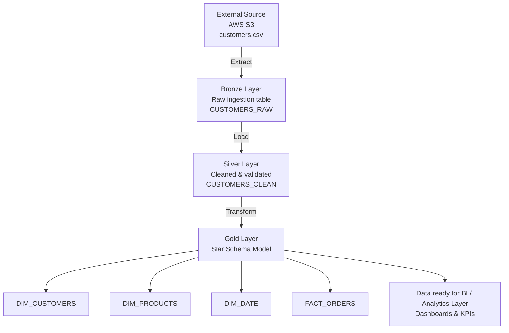

# retail/e-commerce sales snowflake analytics warehouse

<br>

## ❄️🔨 Snowflake Medallion Architecture Data Pipeline (End-to-End ELT Project)

<br>

### 🎯 Business problem: 
A business with customer data spread across transactional systems (CRM, orders, support tickets) can't reliably join or aggregate it for analytics, data arrives in different formats, updates conflict, and there's no single source of truth for what a "customer" actually is.

### 🧠 Business use cases: 
Analysts and product managers need to segment customers high-value, churn-risk, and track metrics LTV, churn rate, feature adoption over time. They need a query-able, deduplicated, historically accurate customer dimension that they can join against transaction tables without second-guessing the data.

### 📊 Business Solution: 
This ELT pipeline lands raw customer records in a Bronze layer, deduplicates and enriches them in Silver enforcing a single customer identity, and exposes clean historical tables in Gold for analytics. Snowflake's native data sharing and time-travel tables mean the whole process stays inside one platform — no ETL orchestrator or external tooling overhead  which is a practical fit for a small analytics team.

---


#### 📃 Don't forget to check out my '/docs' folder in this repository which briefly goes over deep points on why I chose this design architecture, also it's my own learning resource/notes to help me too! 

<br> 

### 📖 Overview

This project demonstrates an end-to-end data engineering pipeline using Snowflake, implementing a medallion architecture (Bronze, Silver, Gold) and a dimensional star schema model for analytics.

The pipeline includes data ingestion, transformation, modelling, and data quality layers designed to simulate a real-world data warehouse environment.

<br>

### 🏗️ Architecture




```
ELT FLOW 

E = Extract
    Extract raw CSV data from AWS S3

L = Load
    Load raw data directly into Snowflake Bronze layer

T = Transform
    Transform data inside Snowflake:
    - Cleaning
    - null checks on keys, duplicate detection, type/format checking 
    - MERGE logic
    - Star schema modelling
    - Aggregations
```


```

ELT PIPELINE
├── Bronze (raw ingestion)
├── Silver (cleaning + data checks)
├── Gold (star schema model)
└── Production Layer
    ├── Logging
    ├── Monitoring
    ├── Alerts (conceptual)
    └── Retry strategy

```


#### ⚙️ Tech Stack

- Snowflake (Data Warehouse)
- SQL (Transformation & Modelling)
- S3 (Data Source)
- Medallion Architecture (Bronze/Silver/Gold)
- Star Schema Data Modelling


#### 🔄 Pipeline Flow

1. Data ingested into Bronze layer (raw data)
2. Cleaned and checked type/format, duplicates, and nulls in Silver layer
3. Transformed into Gold layer (fact + dimension tables)
4. Analytical models created for reporting


#### 🧱 Data Model

- DIM_CUSTOMERS
- DIM_PRODUCTS
- DIM_DATE
- FACT_ORDERS


#### 📊 Key Features

- Medallion architecture implementation
- Star schema design
- Incremental processing logic
- Data quality checks
- Business-ready analytical models


###### 🚀 How to Run

1. Execute scripts in /sql folder in order
2. Load sample data into Snowflake
3. Run Bronze → Silver → Gold pipeline
4. Query Gold layer for analytics


###### 📌 Key Learnings

- Data modelling using star schema
- ELT pipeline design in Snowflake
- Data quality techniques
- Incremental data processing concepts


